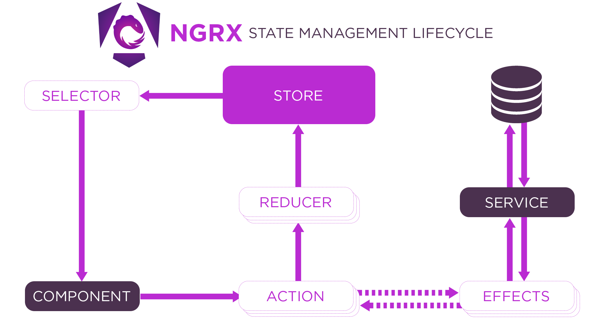

# Store:

- Actions:
- Selectors:
  

plan:
https://www.mindmeister.com/app/map/3658983944?source=blank

ITCSS, SMACSS, CUBE CSS

token
Currently, you have spacing and colors, but a full token system would also include:
Typography scales (not just font sizes)
Border radius values
Shadow systems
Animation durations/easing
Z-index management
